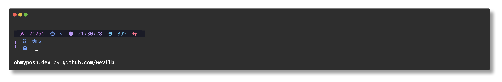
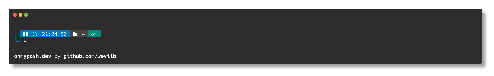
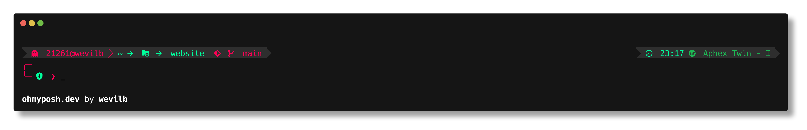
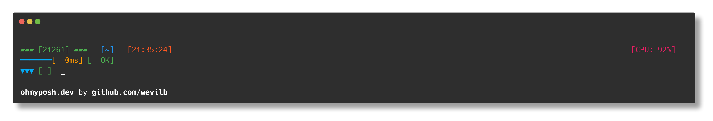
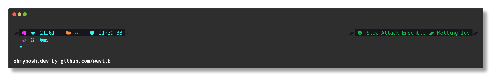
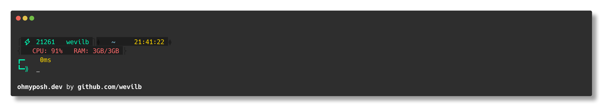
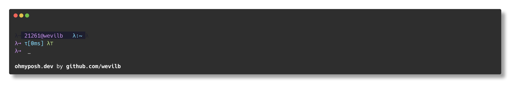
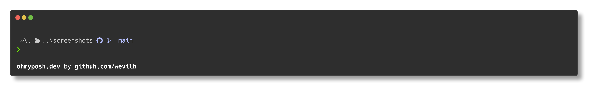

<div align="center">


# 🌌Custom Oh-My-Posh Theme

A personalized terminal prompt theme configuration using Oh My Posh - the prompt theme
engine for any shell.

[](https://ohmyposh.dev/)

[](LICENSE)


## 
| Themes | Preview |
| ------ | ------  |
| [cosmic](themes/cosmic.omp.json) ||
| [cosmic-navigator](themes/cosmic-navigator.omp.json) ||
| [cyberpunk](themes/cyberpunk.omp.json) ||
| [kawaii-terminal](themes/kawaii-terminal.omp.json) ||
| [neuro-flow](themes/neuro-flow.omp.json) ||
| [quantum-matrix](themes/quantum-matrix.omp.json) ||
| [synthwave](themes/synthwave.omp.json) ||
| [uni-art](themes/uni-art.omp.json) ||
| [wevilb](themes/wevilb.omp.json) ||
| [spl](themes/spl.omp.json) ||
| [bubble-brackets](themes/bubble-brackets.omp.json) |<image src="assets/screenshots/bubble-brackets.png">|
</div>

##
##  Features

- 📊 Git status integration
- ⏱️ Execution time for commands
- 🔋 Battery status indicator
- 📂 Current directory path
- 🕒 Timestamp
- 🐍 Python virtual environment detection
- 💻 Multiple shell support (PowerShell, Bash, Zsh)

## 🛠️ Prerequisites

- [Oh My Posh](https://ohmyposh.dev/) installed
- A [Nerd Font](https://www.nerdfonts.com/) installed and configured in your terminal
- Your preferred terminal (Windows Terminal, iTerm2, etc.)

## Installation

### Windows

```powershell
winget install JanDeDobbeleer.OhMyPosh
```

### Linux/macOS
```bash
curl -s https://ohmyposh.dev/install.sh | bash
```

## ⚙️ Configuration

### Cmd ([Clink](https://chrisant996.github.io/clink/))
```cmd
load(io.popen('oh-my-posh init cmd --config yourtheme-url.omp.json'):read("*a"))()
```

### PowerShell
```powershell
oh-my-posh init pwsh --config ~/path/to/yourtheme.omp.json | Invoke-Expression
```

### Bash
```bash
eval "$(oh-my-posh init bash --config ~/path/to/yourtheme.omp.json)"
```

### Zsh
```zsh
eval "$(oh-my-posh init zsh --config ~/path/to/yourtheme.omp.json)"
```

## Troubleshooting

### Common Issues

1. **Missing icons**: Ensure you have a Nerd Font installed and configured in your terminal.
2. **Broken layout**: Update your terminal font to a Nerd Font.
3. **Performance issues**: Consider disabling heavy segments like Git status in large repositories.

## 🤝 Contributing

Contributions are welcome! Please feel free to submit a Pull Request.

1. Fork the repository.
2. Create your feature branch (`git checkout -b feature/AmazingFeature`).
3. Commit your changes (`git commit -m 'Add some AmazingFeature'`).
4. Push to the branch (`git push origin feature/AmazingFeature`).
5. Open a Pull Request.

## License

This project is licensed under the MIT License - see the [LICENSE](LICENSE) file for details.

## 🙏 Acknowledgments

- [Oh My Posh](https://ohmyposh.dev/) - The awesome prompt theme engine.
- [Nerd Fonts](https://www.nerdfonts.com/) - For the amazing icons.
- [PowerLevel10k](https://github.com/romkatv/powerlevel10k) - Inspiration for some features.


## Performance

This theme configuration has been optimized for performance, with most prompts rendering in under 50ms on modern hardware.

---
<div align="center">
  
Made by [wevilb](https://github.com/wevilb)
</div>
